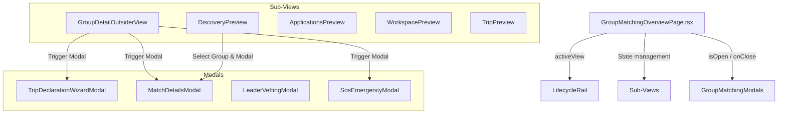

# 🧭 Kiến Trúc & Hướng Dẫn Component Module Hóa: Feature Companion Groups (Group Matching)

Tệp tài liệu này hướng dẫn chi tiết cấu trúc thư mục, trách nhiệm của từng component và luồng dữ liệu (Data Flow) thuộc module **Group Matching (Ghép nhóm Trekking C2C)** trong dự án TrekSphere Frontend.

---

## 📐 1. Tổng Quan Cấu Trúc Thư Mục (Directory Architecture)

Toàn bộ mã nguồn của tính năng ghép nhóm đã được tách bạch rõ ràng từ tệp monolithic 2,000+ dòng ban đầu thành các thư mục chuyên biệt:

```text
src/features/companion-groups/
├── types/
│   └── groupMatchingTypes.ts        # Định nghĩa các kiểu dữ liệu (Types & Interfaces)
├── data/
│   └── groupMatchingMocks.ts        # Dữ liệu giả lập (Mock data) & Cấu hình cố định (Configs)
├── components/
│   ├── overview/
│   │   ├── LifecycleRail.tsx                 # Thanh tiến trình Vòng đời nhóm (5 bước C2C)
│   │   ├── GroupDetailOutsiderView.tsx       # Component Chi tiết Nhóm góc nhìn người ngoài (Figma 451:1188)
│   │   ├── DiscoveryPreview.tsx             # Giao diện Khám phá & Đề xuất nhóm ghép (Matching Engine)
│   │   ├── ApplicationsPreview.tsx          # Giao diện Quản lý Đơn tham gia & Duyệt ứng viên
│   │   ├── WorkspacePreview.tsx             # Không gian Làm việc Nhóm (Workspace Hub & Succession)
│   │   └── TripPreview.tsx                  # Giao diện Theo dõi Chuyến đi Thực địa & Trung tâm SOS
│   └── modals/
│       └── GroupMatchingModals.tsx          # Tất cả Modal tương tác (Wizard, Match Details, Leader Vetting, SOS)
└── pages/
    └── GroupMatchingOverviewPage.tsx        # Controller Page siêu gọn nhẹ (~120 dòng) quản lý state & điều hướng
```

---

## 🧩 2. Trách Nhiệm Của Từng Component (Component Breakdown)

| Tệp tin (File) | Loại (Type) | Mô tả & Trách nhiệm chính |
| :--- | :--- | :--- |
| **`groupMatchingTypes.ts`** | Types | Khai báo `PreviewView`, `GroupRecommendation`, `ApplicationRow`, `LifecycleStep`, `WorkspaceSubTab`. |
| **`groupMatchingMocks.ts`** | Mock Data | Chứa dữ liệu danh sách nhóm gợi ý, danh sách đơn ứng tuyển, các trạm dừng và cấu hình navigation. |
| **`GroupMatchingOverviewPage.tsx`** | Container Page | **Trang chính (~120 dòng)**. Chỉ chịu trách nhiệm quản lý state toàn cục (`activeView`, `selectedMatchGroup`, trạng thái đóng/mở Modal) và điều hướng. |
| **`LifecycleRail.tsx`** | Component | Hiển thị thanh tiến trình 5 giai đoạn vòng đời nhóm C2C: *Bản nháp ➔ Đang tuyển ➔ Sẵn sàng ➔ Đang đi ➔ Hoàn tất*. |
| **`GroupDetailOutsiderView.tsx`** | Component | **Giao diện chuẩn Figma Node 451:1188**. Bao gồm Hero Cover, Sub-tab bar (Tổng quan, Lộ trình, Thành viên, Ngân sách, An toàn) và Sticky Join Sidebar. |
| **`DiscoveryPreview.tsx`** | Component | Hiển thị danh sách thẻ nhóm gợi ý với chỉ số tương thích (%) và lý do gợi ý từ thuật toán Matching Engine. |
| **`ApplicationsPreview.tsx`** | Component | Cho phép Trưởng nhóm (Leader) xem đơn ứng tuyển, kiểm tra hồ sơ thể lực và chấp nhận/từ chối ứng viên. |
| **`WorkspacePreview.tsx`** | Component | Không gian làm việc nội bộ nhóm sau khi chốt danh sách, tích hợp giao thức chuyển giao quyền Leader (*Leader Succession Protocol*). |
| **`TripPreview.tsx`** | Component | Giao diện hỗ trợ đi thực địa, theo dõi vị trí độ cao/điểm danh và hỗ trợ liên hệ khẩn cấp. |
| **`GroupMatchingModals.tsx`** | Modals | Chứa 4 Modal tương tác độc lập:<br/>1. `TripDeclarationWizardModal`: Wizard 3 bước khai báo nhu cầu.<br/>2. `MatchDetailsModal`: Bảng điểm tương thích chi tiết.<br/>3. `LeaderVettingModal`: Tiêu chuẩn KYC & Uy tín Leader.<br/>4. `SosEmergencyModal`: Bảng phát tín hiệu SOS cứu hộ. |

---

## 🔄 3. Luồng Dữ Liệu & Tương Tác (Data Flow)



1. **State Centralization**: `GroupMatchingOverviewPage` giữ vai trò Orchestration, quản lý `activeLifecycleIndex`, `activeView` và `selectedMatchGroup`.
2. **Event Delegation**: Khi người dùng nhấn nút trên các view con (ví dụ: nút *"Match 92%"* hoặc *"🆘 SOS"* trên `GroupDetailOutsiderView`), component con gọi callback prop do `GroupMatchingOverviewPage` truyền xuống để mở Modal tương ứng.
3. **Decoupled Business Logic**: Việc tách rời giúp dễ dàng bảo trì, nâng cấp giao diện từng phần hoặc kết nối với các REST API backend sau này mà không làm ảnh hưởng đến các thành phần còn lại.

---

## ✅ 4. Kiểm Tra Biên Dịch (Validation)

Mã nguồn đã được kiểm tra bằng lệnh `npx tsc --noEmit` và đạt **0 lỗi TypeScript**. All import paths adhere strictly to the project's `@/` alias standard.
