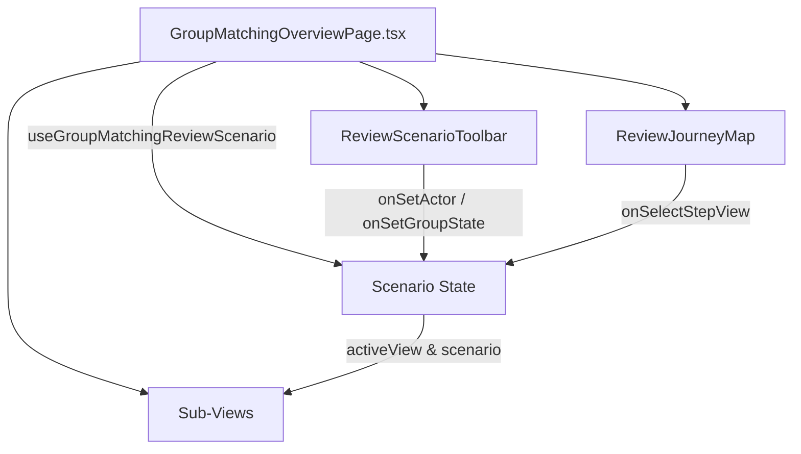

# 🧭 Kiến Trúc & Hướng Dẫn Review Workbench: Feature Companion Groups (Group Matching)

Tài liệu này hướng dẫn chi tiết cấu trúc thư mục, trách nhiệm của từng component và mô hình **Review Workbench** thuộc module **Group Matching (Ghép nhóm Trekking C2C)** trong dự án TrekSphere Frontend.

---

## 📐 1. Tổng Quan Cấu Trúc Thư Mục (Directory Architecture)

```text
src/features/companion-groups/
├── types/
│   └── groupMatchingTypes.ts                 # Định nghĩa types, ReviewActor, GroupLifecycleState, Scenario models
├── data/
│   └── groupMatchingMocks.ts                 # Dữ liệu giả lập (Mock data), Review Presets & Cấu hình cố định
├── hooks/
│   ├── useGroupMatchingReviewScenario.ts     # Hook quản lý state Review Scenario tập trung
│   └── ... (API hooks khác)
├── components/
│   ├── review/
│   │   ├── ReviewScenarioToolbar.tsx         # Thanh điều khiển chọn Actor, GroupState, AppState, Network & GPS
│   │   └── ReviewJourneyMap.tsx              # Sơ đồ điều hướng 5 chặng hành trình C2C
│   ├── overview/
│   │   ├── LifecycleRail.tsx                 # Thanh tiến trình Vòng đời nhóm (6 bước C2C)
│   │   ├── GroupDetailOutsiderView.tsx       # Component Chi tiết Nhóm góc nhìn người ngoài
│   │   ├── DiscoveryPreview.tsx              # Giao diện Khám phá & Đề xuất nhóm ghép
│   │   ├── ApplicationsPreview.tsx           # Giao diện Quản lý Đơn tham gia & Duyệt ứng viên
│   │   ├── WorkspacePreview.tsx              # Không gian Làm việc Nhóm (Workspace Hub & Succession)
│   │   ├── EquipmentWorkspace.tsx            # Phân công công việc & Đồ dùng chuẩn bị (Checklist/Tasks)
│   │   └── TripPreview.tsx                   # Giao diện Theo dõi Chuyến đi Thực địa & Trung tâm SOS
│   └── modals/
│       └── GroupMatchingModals.tsx           # Các Modal tương tác (Wizard, Match Details, Leader Vetting, SOS)
└── pages/
    └── GroupMatchingOverviewPage.tsx         # Controller Page siêu gọn nhẹ tích hợp Review Shell & Sub-views
```

---

## 🎛️ 2. Review Scenario Model & Presets

Workbench hoạt động dựa trên kịch bản tập trung (Review Scenario) giúp xem trước toàn bộ trạng thái mà không phụ thuộc backend:

### Kịch Bản Mẫu (Review Presets):
1. **Góc nhìn Người ngoài (Outsider / Guest)**: Người dùng chưa vào nhóm, khám phá gợi ý & xem thông tin chi tiết.
2. **Ứng viên Chờ duyệt (Waitlisted Applicant)**: Đã gửi đơn, xem vị trí danh sách chờ hoặc Slot Offer.
3. **Trưởng nhóm Duyệt đơn (Leader Reviewing)**: Leader duyệt ứng viên, chấp nhận, từ chối hoặc gửi offer.
4. **Chuyến đi Thực địa & SOS (Trip & Emergency)**: Thành viên thực hiện điểm danh check-in và gửi SOS cứu hộ.
5. **Hậu chuyến đi (Settlement & Memories)**: Quyết toán quỹ C2C, đánh giá thành viên và đăng album kỷ niệm.

---

## 📋 3. Ranh Giới Nghiệp Vụ "Phân Công Cơ Bản" (Checklist & Assignment)

Được giữ trong Review Workbench:
- Danh sách công việc / đồ dùng chuyến đi (Checklist items & Tasks).
- Người phụ trách (Assignee) & hạn chót.
- Trạng thái `TODO`, `IN_PROGRESS`, `DONE` hoặc `NOT_READY`, `READY`.
- Phân loại đồ dùng cá nhân vs đồ dùng chung nhóm.

Không mở rộng / Không mô phỏng:
- Quản lý tồn kho (Inventory/Stock).
- Thuê, trả, đặt cọc thiết bị.
- Điều phối Porter / Vendor logistics.

---

## 🔄 4. Luồng Dữ Liệu Review Shell (Data Flow)



---

## ✅ 5. Lệnh Kiểm Tra Biên Dịch

```powershell
pnpm typecheck
pnpm biome check src/features/companion-groups
pnpm build
```
